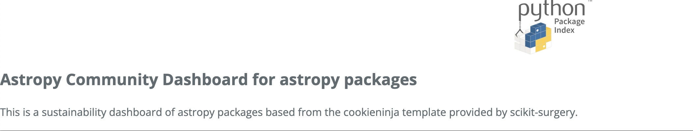
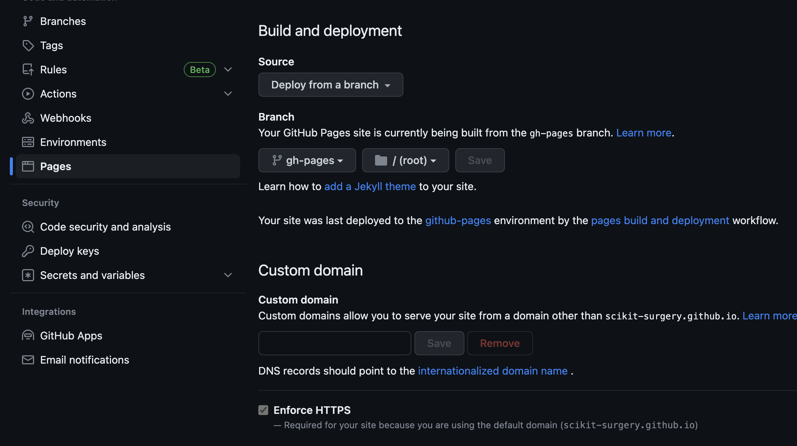

scikit-surgery-stats
====================

.. image:: https://img.shields.io/twitter/url?style=social&url=http%3A%2F%2Fscikit-surgery.org
   :target: https://twitter.com/intent/tweet?screen_name=scikit_surgery&ref_src=twsrc%5Etfw
   :alt: Get in touch via twitter

.. image:: https://img.shields.io/twitter/follow/scikit_surgery?style=social
   :target: https://twitter.com/scikit_surgery?ref_src=twsrc%5Etfw
   :alt: Follow scikit_surgery on twitter

This is a set of scripts to get statistics on the scikit-surgery library
and turn them into a nice webpage

.. image:: https://github.com/scikit-surgery/scikit-surgery-stats/raw/master/assets/screenshot.png
    :width: 400px
    :target: http://scikit-surgery.github.io/scikit-surgery-stats/
    :alt: Link to the dashboard


Sustainability dashboard template for community
================================================

We provide a repository template for creating a sustainability dashboard for your own library/ecosystem of interest.
It automatically creates the scripts and files needed to run the analysis needed for deployment of dashboard showing metrics of libraries existing within a given base Python package/ecosystem, and
it includes the Github Action that deploys the produced html files to the `gh-pages` branch of a target repository, which triggers a deployment every 12 hours, using the `cron` scheduler.

## Using the template

1. Install `cookieninja <https://libraries.io/pypi/cookieninja>`__

   ```
   pip install cookieninja
   ```
2. Run cookieninja in the desired location

    `cookieninja gh:scikit-surgery/scikit-surgery-stats`

    If you have this repo locally (this may be the case if you are developing, or you cloned this repository before), you can alternatively run the following:

    `cookieninja /path/to/your/checkout/of/python-template`

3. A series of questions will pop up to configure the project. Type the answer or hit return to use the default option (shown in square brackets)

..  tip::
        It is crucial you enter a value for `base_library_name` as the dashboard analysis scripts will be configured for this base package. There is a
        script the cookieninja runs placed under `hooks/pre_gen_project.py` that checks if the name given returns package entries in pypi search.

    .. code-block::

            author_name [John Smith]:
            author_email [temp@gmail.com]:
            project_name [Community Dashboard]:
            base_library_name [scikit-surgery]:
            project_short_description [A dashboard template from scikit-surgery]:
            funder [JBFC: The Joe Bloggs Funding Council]:
            licence ["MIT", "BSD-3", "GPL-3.0"]:
            "_copy_without_render [".github/*"]:

Note that these project variables are defined in the `cookiecutter.json` file.

4. This will create a directory with the following configuration:

    For example, for a project with the following variables:

    .. code-block::

        project_name : Astropy Community Dashboard
        base_library_name : astropy

    We will get a project folder named after `astropy-dashboard`, structured like this:


    |  astropy-dashboard
    |    ├── LICENSE
    |    ├── README.md
    |    ├── _config.yml
    |    ├── get_badges.py
    |    ├── get_github_repos.py
    |    ├── get_loc.py
    |    ├── get_pypi_repos.py
    |    ├── html
    |    │   ├── dashboard.html
    |    │   ├── dashboard.html.in.head
    |    │   ├── dashboard.html.in.tail
    |    │   ├── excluded.html.in.head
    |    │   ├── excluded.html.in.tail
    |    │   └── exclusions.html
    |    ├── index.html
    |    ├── libraries
    |    │   ├── exclusions
    |    ├── pypi-simple-search
    |    ├── sksurgerystats
    |    │   ├── __init__.py
    |    │   ├── common.py
    |    │   ├── from_github.py
    |    │   ├── from_pypi.py
    |    │   ├── html.py
    |    │   └── pypi_downloads.py
    |    ├── static
    |    │   └── loc_plot.js
    |    ├── templates
    |    │   ├── dashboard.css
    |    │   └── loc_plot.html
    |    ├── tests
    |    │   ├── conftest.py
    |    │   └── test_template_workflow.py
    |    ├── update_dashboard.py
    |    ├── update_github_stats.py
    |    ├── update_pypi_stats.py
    |    └── workflows
    |        ├── linting.yml
    |        ├── republish.yml
    |        └── tests.yml


   Important configurations to note:

   1.  `get_github_repos.py` and `get_pypi_repos.py` will take `base_library_name` as the base name to search packages in `https://pypi.org/search/`
        and github

   2.   `project_name` will appear in the README.md as the human-readable name of the project.

   3.   `html/dashboard.html` will take `project_name` as the main title, Astropy Community Dashboard, and also use `project_slug` for a description below the logo,
         as shown here:



5. To run the pipeline, you first need to install the dependencies using the `requirements.txt` file installed via step 3

    .. code-block::
        mkdir env
        python -m venv env/
        source env/bin/activate
        pip install -r requirements.txt

6. To run the analysis scripts, test locally, you need a personal access token for Github API generated from `here <https://github.com/settings/personal-access-tokens/new>`__

+ Save it in the base directory under a text file named `github.token`

7. Few [optional] things to set before you can run the pipeline!

    a. You can specify a list for the libraries you want to exclude from your dashboard deployment, under `libraries/exclusions`

        Similar to `libraries` folder, this (as shown below) has a dict entry for each package, such as in this example from `scikit-surgery`:
            | libraries/exclusions
            | ├── scikit-surgeryoverlay
            | ├── scikit-surgerytorsosimulator
            | └── scikit-surgeryvideoutils

        Each file entry (ex. scikit-surgeryoverlay) is a `.json` file that has :
        an `obsolete` key and a value that is a sentence describing why they are obsolete, such as:
        ```{"obsolete" : "Became <a href='https://github.com/UCL/scikit-surgeryvtk'>sikit-surgeryvtk.</a>"}```

    b. You can save the logo of your base package (a .svg file) under `assets/logo-dashboard.svg` for it to show up in your deployment header

8. ESSENTIAL: Github Configurations
    a. You need to initialise github pages in your repository and set the deployment source from branch `gh-pages` :
        Github Action will automatically initialise this branch and deploy from
        here. You can find the instructions
        `here <https://docs.github.com/en/pages/getting-started-with-github-pages/configuring-a-publishing-source-for-your-github-pages-site>`__

        You might need admin rights from your organisation to use your organisation's base name. You can also use your username as the domain.

        Your configuration will need to look like this (In the example below, our domain name is the `scikit-surgery` organisation):



b. You need a secret personal token to use the github API in the Github Action workflow, saved as `secrets.ADMIN_TOKEN`. For this you
will need admin rights in your organisation and repository. You can read more on secret Github tokens `here <https://docs.github.com/en/actions/security-guides/encrypted-secrets`__

    1. Go to the Settings
    2. Go to Security -> Actions -> Repository secrets
    3. Add a key named `ADMIN_TOKEN` and leave the value blank. Github runner will take care of this in Github Actions.

    This is the same type of token you saved locally in Step 6. Yo should never
    version control/track this token in your remote repository,  so here we are creating
    a field for it which Github Action can reference in deployment.

9. Running the pipeline

The Github Actions workflow will run this pipeline, so you do not need to do anything. But locally, you can check if the pipeline works correctly,
by running the python scripts ordered and referenced in the `Makefile` file of this repository.

Note for checking if things work properly:
- while running `get_badges.py` you should notice that under `libraries` folder, there are .json files of dictionary entries for each package


Use instructions for developers
=================================

1. Activating the environment

        mkdir env

        python -m venv env/

        source env/bin/activate

        pip install -r requirements

2. Make sure you have a personal access token for Github API generated from `here <https://github.com/settings/personal-access-tokens/new>`_
    and is saved in the base directory under a file named `github.token`

3. Running the pipeline that generates dashboard.html and associated files needed by Github Pages

        bash Makefile

    or you can run the individual python scripts to check outputs

        #step 1 search for relevant packages on pypi and githib
        python get_pypi_repos.py
        python get_github_repos.py
        #update stats
        python update_pypi_stats.py
        python update_github_stats.py
        #get coverage/docs/etc badges
        python get_badges.py
        #update html files
        python update_dashboard.py


*  Inspect libraries with pypi

        ./pypi-simple-search scikit-surgery > scikit-surgery-onpypi.txt

        python get_github_repos.py > scikit-surgery-ongithub.txt

    We can use pypinfo to get data for things on pypi


        pypinfo --auth snappy-downloads-3d3fb7e245fd.json
        pypinfo scikit-surgeryvtk country
